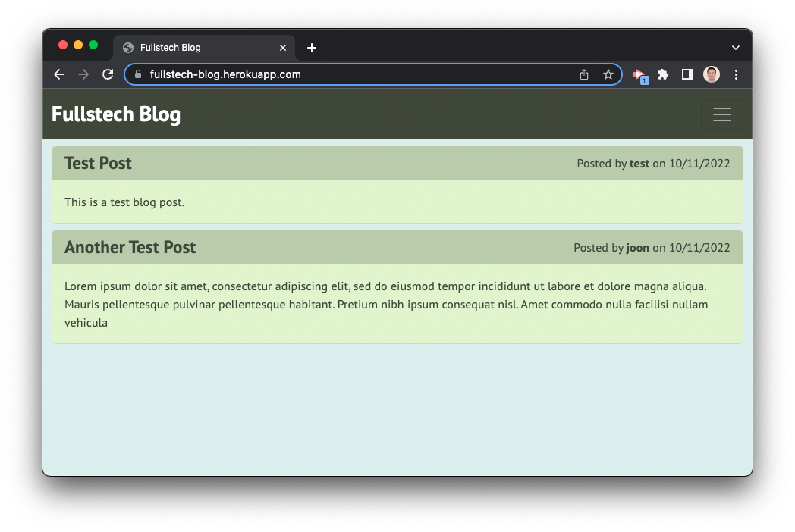
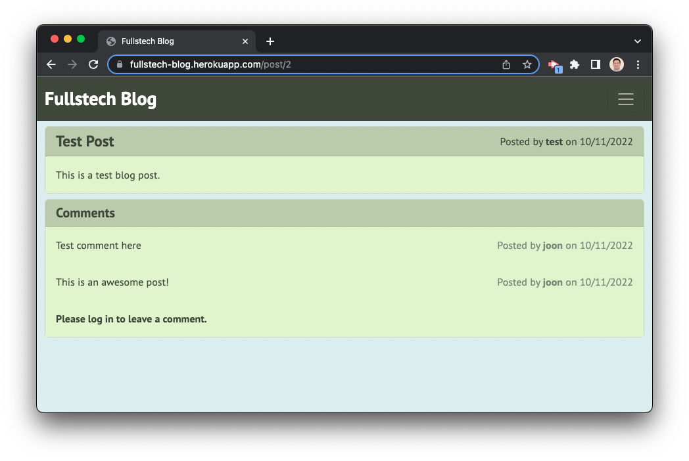
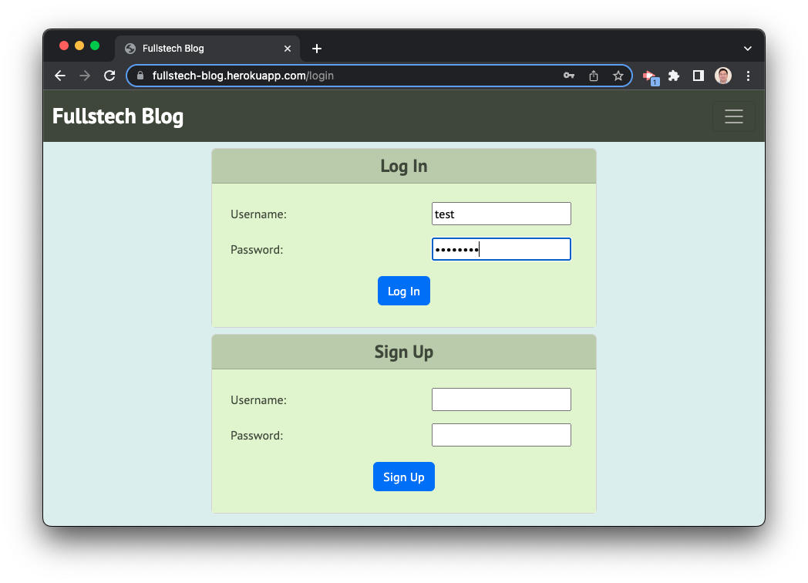
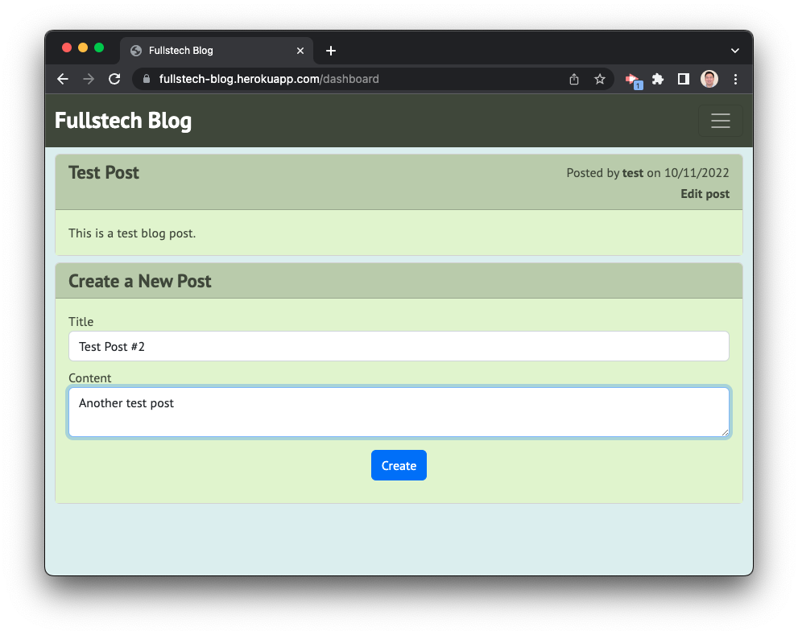
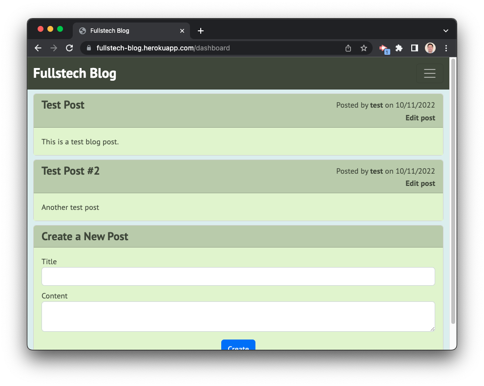
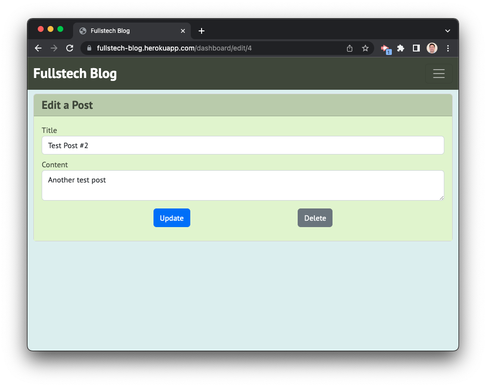
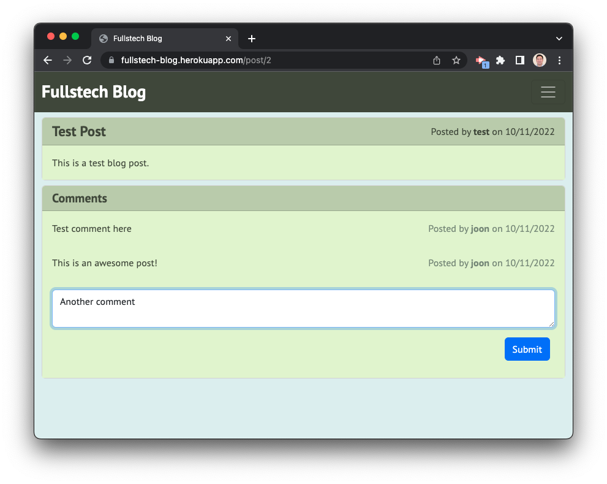

# MVC-Tech-Blog

## Description

A CMS-style blog site that allows the user to log in and create, edit, and delete blog posts that are stored on the site's database. Users may also comment on a given blog post.

## Usage

The deployed application can be found at:

[Fullstech Blog](https://fullstech-blog.herokuapp.com/)

The home page shows existing blog posts.

Clicking on the title of a post opens up the post and shows comments.

Click on "Log In" (on mobile, need to expand the nav menu first) to log in or sign up.

Logging in or signing up will bring the user to the Dashboard, where they can view their posts and add a new post.

Creating a new post will add it to the user's dashboard as well as the database.

Clicking on "Edit post" will allow the user to edit the post or delete it.

Clicking on the title of a post will show comments associated with the post, with an option to add more comments

## License

Licensed under the MIT license.